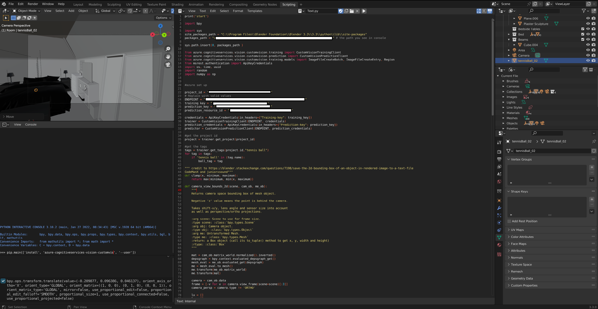

# Blender-to-Azure-custom-vision
A script to automatically generate images for Azure custom vision to Blender.

For more infomation see (this blog post.)[https://ferguskidd.com/0-data-vision-model/]

To use this script, set up a scene in blender, set up a cycles render engine, open scripting and use the script.py file. Make sure to update you Azure custom vision details.

When running the script, the object you wish to output to custom vision should be selected in teh blender viewer.

